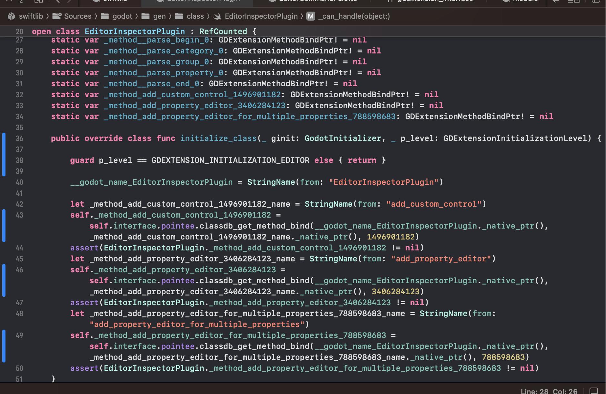

# swiftlib

[By @jki on mastodon.gamedev.place](https://mastodon.gamedev.place/@jki)

Very early experimental GDExtension bindings for Swift. Don't expect anything to work here.

Being tested with Godot v4 beta 17

    ./regenbindings.sh

## godot

    ./Godot --dump-extension-api --dump-gdextension-interface

## Tests

    ./_etest.sh

## TODO tracking

- [ ] Remove local paths from test scripts
- [ ] Investigate why deinit not called on builtin classes

